# Ubuntu 22.04 LTS Initial Installation Notes
 
This document contains useful tips to install various applications on a new Ubuntu 22.04 installation.
These applications vary from development tools to office management.
 
* * *
## Outlook for Office365 accounts: 
- [ ] Installation:
`sudo snap install prospect-mail`
- [ ] Setup:
	- Connect using your Microsoft LDAP account

* * *
## Emails for private Exchange accounts: 
- [ ] Installation:
`sudo apt install evolution-ews`
- [ ] Setup:
  - Go to `Activities` > `Evolution`
  - On the top menu: Go to `Edit` > `Accounts`
  - Click on Add Email Account.
  - On the `Server Type` select `Exchange Web Services`
  - Update the Exchange url in the form `https://mail.xxxxx.com/EWS/Exchange.asmx)/`
    If you are not sure what to add, usually the domain of the server matches your online owa weblink (usually provided in the form of `https:://mail.xxxxxx.com/owa`)

* * *
## ClamAV Antivirus: 
- [ ] Installation:
`sudo apt install clamav clamtk`
- [ ] Setup:
	- Hit `Activities`, Search for `Clamtk`, and execute
 	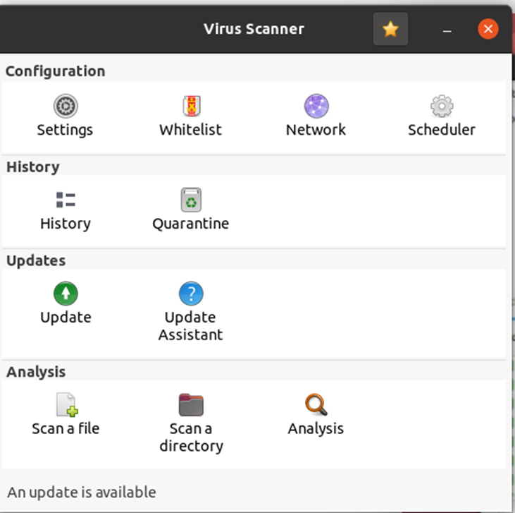

	- Hit `Settings`:
 	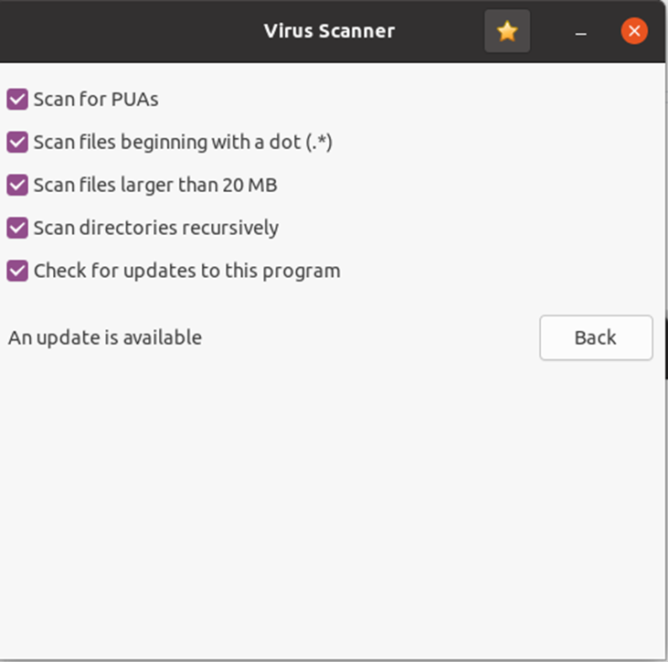

	- Tick **EVERYTHING**!
	- Hit `Back` and then hit `Scheduler`:
	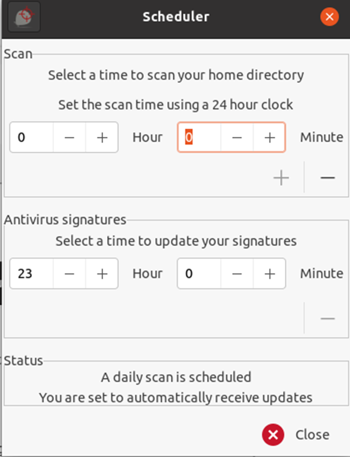

 	- Select the time you want your Antivirus to perform a scan. The screenshot shows 00:00 everyday.
	- Hit the `+` button below. Make sure than the `Status` changed to `A daily scan is scheduled`
	- Select the time you want your Signatures to be updated. The screenshot shows 23:00 everyday.
	- Hit Enter and make sure that the `Status` changed to `You are set to automatically receive updates`

* * *
##  Essential Development Software: 
- [ ] Installation:
	```bash
	sudo apt update && sudo apt -y upgrade && sudo apt -y dist-upgrade \
	&& sudo apt -y --no-install-recommends install curl wget build-essential \
	vim ca-certificates libclang* cmake libssl-dev protobuf-compiler libprotobuf-dev \
	dos2unix docker openssh-server gitg net-tools docker.io
	```

- [ ] Setup:
	- This command installs all necessary development tools we currently need in Ubuntu

* * *
##  Teams for Linux: 
- [ ] Installation:
	- Get the latest version from:  https://www.microsoft.com/en-us/microsoft-teams/download-app 
- [ ] Setup:
	- Login using your Microsoft LDAP account

* * *
 ## Visual Studio Code: 
- [ ] Installation:
	- Use the latest version from: https://code.visualstudio.com/Download 
- [ ] Useful Extensions to install:
	-	Bash Beautify
	-	Bash Debug
	-	Docker
	-	Live Share
	-	Trailing Whitespace
	-	vscode-proto3
	-	YAML
	-	system-unit-file
	-	Linux Desktop File support
	-	rust-analyser
	-	clangd

* * *
## Git global settings: 
- [ ] Setup:
	```bash
	git config --global --edit
	```

- [ ] Modify the file to match something similar to: 
```ini
# This is Git's per-user configuration file.
[user]
name = Mpla Mpla
email = mpla@gmail.com

[credential]
helper = store

[http]
sslVerify = false

[alias]
l = log --all --oneline --decorate --graph --color
s = status -s

[pull]
rebase = false

[core]
excludesFile = "~/tools/git_global_ignore"
```

* * *
##  Pureline Bash Prompt: 
- [ ] Installation:
	- Follow the instructions to download the Pureline source to your Tools folder: https://github.com/chris-marsh/pureline 
 	- Then, execute: `sudo apt install fonts-powerline`
	- \[Optional\]: Use our own [.pureline.conf](pureline.conf) file
	- Then, modify your `~/.bashrc` file and add the following section. Make sure the paths are pointing where you have stored the file above:
	```bash
		if [ "$TERM" != "linux" ]; then
			source ~/tools/pureline/pureline ~/.pureline.conf
		fi
	```

* * *
## Bash Useful optimizations:	 
- [ ] Modify your `~/.bashrc` file and add the following optimizations:
	-	Change EDITOR and VISUAL to match your favourite text editor ( vim or nano)
	- 	Add the aliases to protect accidental removal for files
	```bash
		# User specific aliases and functions
		export EDITOR='vim'
		export VISUAL='vim'
		# Aliases
		alias rm='rm -i'
		alias cp='cp -i'
		alias mv='mv -i'
	```

* * *
## OneDrive for Linux: 
- [ ] Installation:
	```
	sudo apt update
	sudo apt install onedrive
	```
- [ ] Setup:
	- You need to connect and synchronize your organization's OneDrive:
	```
	onedrive --synchronize
	```
	- Copy the link provided to your browser.
	- Login using your Microsoft LDAP account
	- Copy the url of the new window that will open and paste it to the terminal you run the synchronize command.
	- The process will be completed by creating a new ~/OneDrive folder and downloading your files from the cloud.
	- You need to activate the OneDrive service to allow automatic synchronization: 
		```
		systemctl --user enable onedrive
		systemctl --user start onedrive
		systemctl --user status onedrive.service
		journalctl --user-unit=onedrive -f
		```

* * *
 ## Screenshot software (GreenShot alternative for Linux): 
- [ ] Installation:
	```
	sudo apt install flameshot
	```
- [ ] Setup:
	- Use the following instuctions to remap the PrintScr key to flameshot:
		https://www.infosecstudent.com/2020/04/flameshot-remapping-print-screen-key-in.html 

* * *
## Xerox Drivers for Linux: 
- [ ] Setup:
	- Download latest drivers from: 
		https://www.support.xerox.com/en-us/product/workcentre-6515/content/146849 
	- Use the following instructions to install the printer queues:
		https://www.support.xerox.com/en-us/article/en/2077983.html 
	- When you launch the Xerox Print Manager, make sure you wait 1-2mins for the automatic search to be finished and the GUI populates the fields.
	- Manually Add Printer Queue and put the following settings:
 	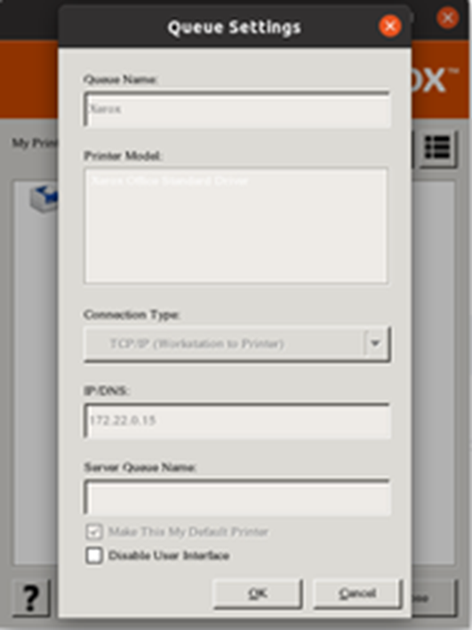
	**Make sure that your Xerox Print IP is correct**
	- Once you hit OK you will see that two printer queues are created in Ubuntu Printer Settings:
 	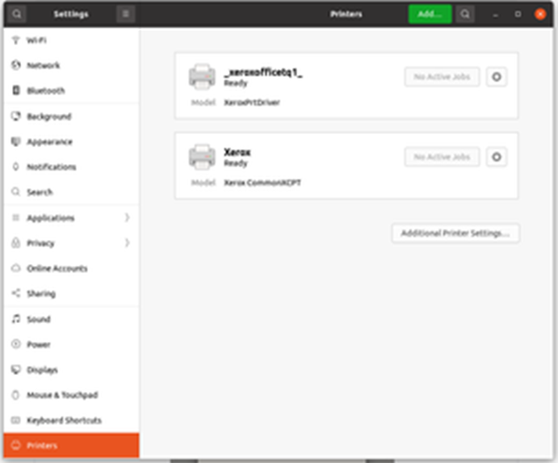
 	- If you do not see both queues, you need to remove the drivers and clean the DB:
		```
		sudo apt remove xeroxofficeprtdrv
		sudo rm -rf /opt/XeroxOffice/
		```
	- Then you can try again from scratch

* * *
##  nVIDIA Drivers for Linux: 
- [ ] Installation:
 	- Execute:
		```
		sudo apt install nvidia-driver-515
		```

* * *
## PulseAudioControl for Linux Sound Cards: 
- [ ] Installation:
	- Ubuntu users can quickly install the Pavucontrol application using the Apt package manager:
	```
	sudo apt install pavucontrol
 	```
	- This application can be called by the command line `pavucontrol` or by searching `Volume Control` in `Activities`.
	- You can then change the output sound device per application etc (just like Windows sound mixer)
	
	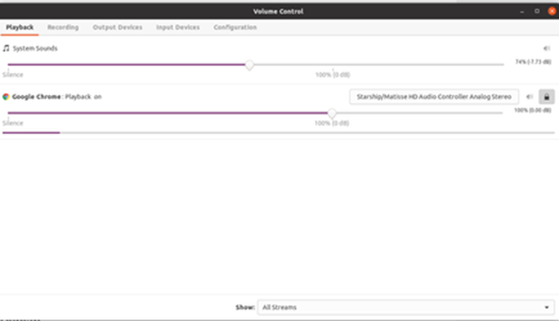
 	
	- If you want to merge sound devices (like outputting the same sound to two devices) you can install Paprefs with:
	```
	sudo apt install paprefs
 	```
	- This application can be called by the command line `paprefs` or searching `PulseAudio Preferences` in `Activities`. 
	- You can then redirect every sound stream to another device or merge them together (Simulteneous Output).
	
	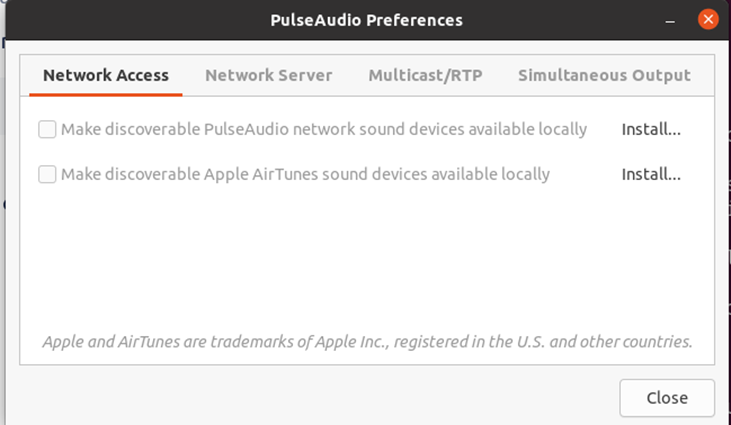
	
 	- Read here for more: https://askubuntu.com/questions/78174/play-sound-through-two-or-more-outputs-devices 

* * *
## Wireshark: 
- [ ] Installation:
	`sudo apt install wireshark`
- [ ] Setup:
	- Once you are asked `“Do you want non-root users to capture packets?”` during installation, hit `<Yes>` 
	- This will create the wireshark user group. You can add users here to allow them to capture network traffic. 
	- To add a user, execute:
		`sudo usermod -a -G wireshark {user name}`

* * *
## SMB File Shares: 
- [ ] Setup:
	- Open file manager in Ubuntu 
	- Click Ctrl + L ( it will show the address bar e.x /home/user )
	- Enter the SAMBA path url. For example:  `smb://172.22.102.1/public/`
	- Enter your credentials credentials
		`Username: <Your Email Address> `
		`Domain: <YOUR DOMAIN>`
		`Password: <Your Email Password>`
	- It will mount the filesharing folder.
	- For persistance right click and select add bookmark.
	- You can rename the bookmark from the left side column.

* * *
##  Remote Desktop from Ubuntu to Windows: 
- [ ] Setup:
 	- Go to Settings:

		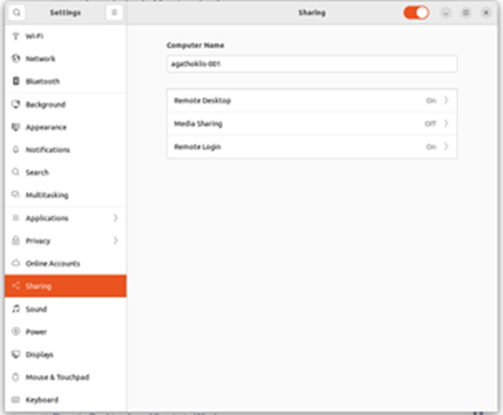
 
	- Turn Remote Desktop on:

		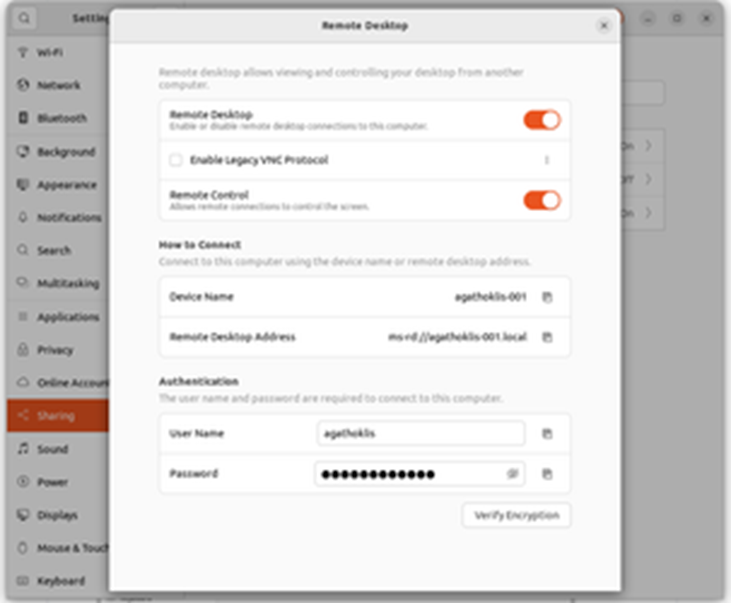
 
	- Make sure you activated Remote Desktop and Remote Control
	- Setup your Remote Desktop Password. By default is different from your actual Linux user password
	- Execute: 
		```
		sudo ufw allow from any to any port 3389 proto tcp
		systemctl --user restart gnome-remote-desktop.service
		```
	- To allow login while Ubuntu PC is locked, execute the following:
		```
		sudo apt install gnome-shell-extension-manager
		```
	- Then, open `Shell Extension Manager` from `Activities` and search for `allow locked remote desktop` and install it:
	
 		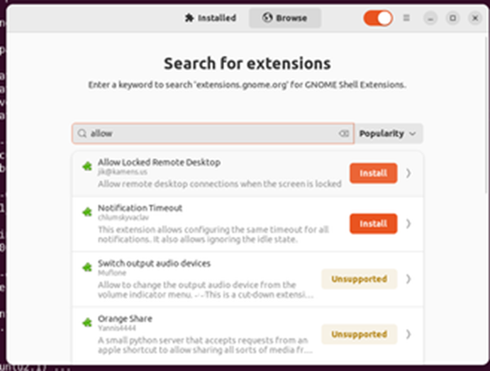
		
	- Go to your Windows Laptop and try to connect using your IP, your user name, and the remote desktop password. 

* * *
## Enable ssh-rsa keys (for connecting to/from old OS to Ubuntu 22.4): 
- To permit using old RSA keys for OpenSSH 8.8+, add the following lines to your `sshd_config`:
	```
	HostKeyAlgorithms=ssh-rsa,ssh-rsa-cert-v01@openssh.com
	PubkeyAcceptedAlgorithms=+ssh-rsa,ssh-rsa-cert-v01@openssh.com
	```
- Then you need to restart the sshd service:
	```bash
	sudo systemctl restart sshd
	sudo systemctl status sshd
	```

* * *
##  Rust Crates Local Registry Installation: 

- [ ] For more details on how to use it in your Rust packages: https://book.ktra.dev/index.html 

- [ ] Register the sp-crates registry in your enviroment:
	- Run this command. curl command required. replace `USER` with your desired `<UserName>`. replace `PASSWORD` with your desired `<Password>`.
	Replace `LOCAL_CRATES_IP` with the IP for the local sp-crates ktra server:
	`vim ~/.cargo/config.toml`
	- Add the following in the file:
		```toml
		[registries]
		local-crates = { index = "https://<PATH_TO_GITLAB>/local-crates.git" }
		[net]
		git-fetch-with-cli = true
		
		### Uncomment this section ONLY if you do not want to import the certificate for the whole system
		#[http]
		#cainfo = "/home/{YOUR_USER_NAME}/<PATH_TO_GITLAB>.crt"
		````

	- **IMPORTANT:** Also, you need to download our Gitlab SSL certificate to the location you put on cainfo field above. 
	- You can import the certificate for the whole system:
		```
		sudo apt-get install -y ca-certificates
		sudo cp ~/<CERTIFICATE>.crt /usr/local/share/ca-certificates
		sudo update-ca-certificates
		```

- [ ] Create a new user:
	- Run this command. curl command required. Replace `USER` with your desired `<UserName>`. Replace `PASSWORD` with your desired `<Password>`.
	Replace `LOCAL_CRATES_IP` with the IP for the local crates ktra server.
		```
		curl -X POST -H 'Content-Type: application/json' -d '{"password":"PASSWORD"}' http://LOCAL_CRATES_IP:8000/ktra/api/v1/new_user/USER
		```
	- Above command responds and prints a new token like this: `{"token":"<TOKEN>"}`
	- Please copy the `<TOKEN>`, the printed unreadable token string.

- [ ] Login to the local cargo registry with cargo command:
	- Run this command with the TOKEN that you copied: 
		```
		cargo login --registry=local-crates <TOKEN>
		```
	- The `local-crates` in the command above is the registry name you specified in `.cargo/config.toml` file.
	- It's completed successfully if you get this message: `Login token for 'local-crates' saved`

-  [ ] Publishing crates:
	-  Go to your Rust project folder
	-  Make sure that you specified `local-crates` as the only repository to publish to by modifying the `publish` tag in `Cargo.toml`: 
		```toml
		[package]
		edition = "2021"
		exclude = ["tests/"]
		name = "my-cool-local-project-rs"
		publish = ["local-crates"]
		version = "0.10.2"
		```

	-  **IMPORTANT:** Remember that the first local-crates user that publishes a new crate **becomes the owner**!

- [ ] Add more owners to the crate:
	- You need to add the rest of sp-crates users as co-owners by executing the following for EVERY user from your project folder:
		```
		cargo owner --registry sp-crates --add ktra-secure-auth:<USER> <CRATE_NAME>
		```
		
* * *
##  Rust Alias to pull and update ALL Rust repositories:
 - Add the following into your `~.bashrc` file:
	```
	alias rust_update='find ~+ . -not -path "*/.git/*" -type d -name "*-rs" -exec  sh -c "echo {}; cd  {} && git pull 2>&1 && cargo update 2>&1 && cd -" \; 2>/dev/null'
	```

	* * *
## GoPass Password Manager: 
 - [ ] Installation:
	 ```
	curl https://packages.gopass.pw/repos/gopass/gopass-archive-keyring.gpg | sudo tee /usr/share/keyrings/gopass-archive-keyring.gpg >/dev/null
	cat << EOF | sudo tee /etc/apt/sources.list.d/gopass.sources
	Types: deb
	URIs: https://packages.gopass.pw/repos/gopass
	Suites: stable
	Architectures: all amd64 arm64 armhf
	Components: main
	Signed-By: /usr/share/keyrings/gopass-archive-keyring.gpg
	EOF
	sudo apt update
	sudo apt install gopass gopass-archive-keyring
	```

 - [ ] Setup:
 - Create a new Gitlab project to store your passwords. For example: https://gitlab.local/development/password-manager.git
 - Run the following and put your email and the path to the git repository you created when asked
	- **IMPORTANT:** Remember to save your personal passphrase. ***Without it you cannot see any passwords***
 
 		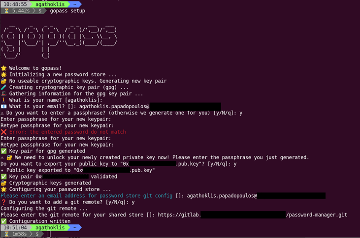
 
	**Quick Commands (from https://github.com/gopasspw/gopass)**:
	- An existing store can be cloned with e.g. 
	`gopass clone https://gitlab.local/development/password-manager.git`
	- Create a new secret:
	`gopass create`
	- List all existing secrets:
	`gopass ls`
	- Copy an existing password to the clipboard:
	`gopass show -c foo`
	- Remove an existing secret:
	`gopass rm foo`
	- Other examples:
		- Command structure
		`gopass [<command>] [options] [args]`
		- Shortcut for gopass show `[<key>]`
		`gopass [<key>]`
		- Enter the gopass REPL:
		`gopass`
		- Find all entries matching the search string
		`gopass find github`
		- List your store
		`gopass ls`
		- List all mounts
		`gopass mounts`
		- List all recipients
		`gopass recipients`
		- Sync with all remotes
		`gopass sync`
		- Setup a new store
		`gopass setup`

* * *
## Install Windows-based Applications (if you can't live without): 
- [ ] **Notepad++**
	```
 	sudo snap install notepad-plus-plus
 	```

- [ ] **MobaXterm:**
	- Follow the instructions to get the latest portable version: https://download.mobatek.net/mobaxterm-on-linux.html 
	- Download our own wrapper `wine-MobaXterm.desktop` 
	- Execute the following to install shortcuts in Activities:
	```
	sudo desktop-file-install wine-MobaXterm.desktop
 	```
	
- [ ] **WinSCP:**
	- Get the latest portable version: https://winscp.net/eng/docs/portable 
	- Download our own wrapper `wine-WinSCP.desktop`
	- Execute the following to install shortcuts in Activities:
	```
	sudo desktop-file-install wine-WinSCP.desktop
 	```
 
 
